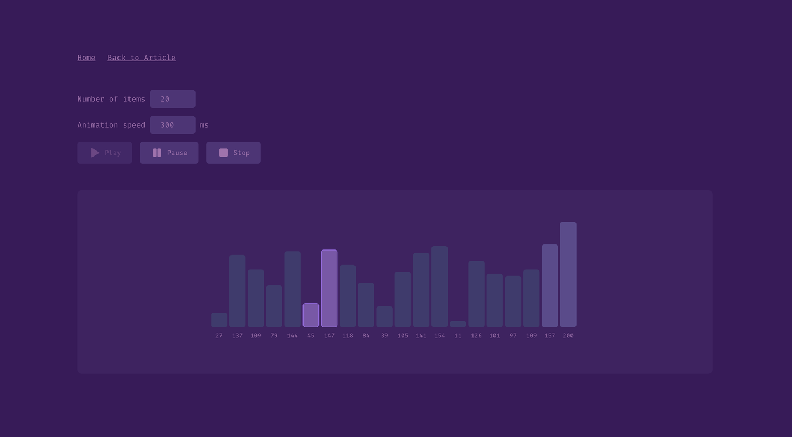

# Visualize Bubble Sort algorithm using SVG

Use Scalable Vector Graphics (SVG) to provide an interactive visual representation of the Bubble Sort algorithm.



- [Article on WANNABEDEV](https://wannabedev.io/tutorials/visualize-bubble-sort-algorithm-using-svg)
- [Working example](https://wannabedev.io/_posts/visualize-bubble-sort-algorithm-using-svg/demo/index.html)

This project is using `vite`.

Run in development mode:
```bash
npm run dev
```

Build for production:
```bash
npm run build
```

## Misc

Follow WANNABEDEV:
- [GitHub](https://github.com/wannabedevio)
- [X (Twitter)](https://twitter.com/wannabedev_io)
- [Instagram](https://www.instagram.com/wannabedev.io/)
- [TikTok](https://www.tiktok.com/@wannabedev.io)

[© WANNABEDEV 2023](https://wannabedev.io)
